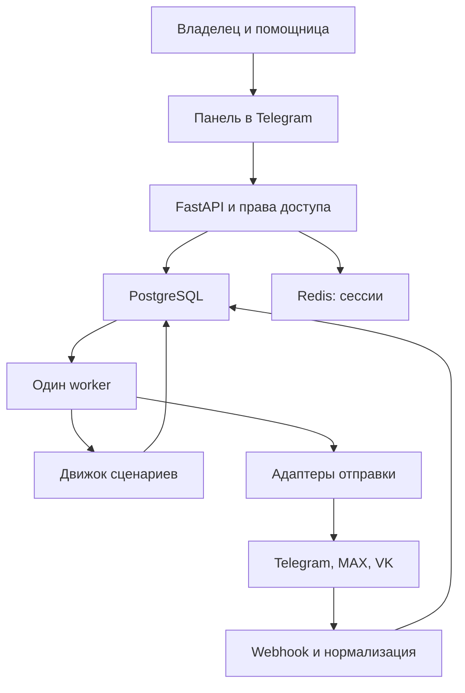

# Архитектура и принципы работы

## Назначение

«Воронка» — собственная серверная система для управления входящими контактами, последовательностями обучения/прогрева, опросами, выдачей материалов и передачей менеджеру. Одна воронка может работать через несколько подключений, но каждый участник проходит её в конкретном подключении. Кросс-платформенный перенос состояния требует отдельного подтверждения идентичности и пока отсутствует.

Владелец — Сергей Водопетов. Помощница входит своим Telegram-аккаунтом. Разделение основано на числовых Telegram ID, а не username, которые могут меняться.

## Уровни

Reverse proxy Caddy обслуживает домен по HTTPS и передаёт запросы API. Процессы API и worker используют единую БД. Worker выполняет сценарии и отправки, API быстро сохраняет webhook до ответа платформе. PostgreSQL хранит бизнес-состояние, Redis — вход администраторов.

Celery для baseline не нужен: долговечные очереди и таймеры реализованы в PostgreSQL, один worker выбирает готовую работу. При масштабировании можно заменить диспетчер на Celery, сохранив БД как источник истины.

## Три разных понятия

| Сущность | Что означает | Пример |
|---|---|---|
| Администратор | Человек, имеющий право работать в системе | Вы или помощница |
| Подключение | Бот/сообщество с отдельными credentials и возможностями | Telegram-бот для ваших проектов |
| Площадка | Конкретный канал/группа, где подключение публикует | Боевая аналитика, ИИ-контекст |

Можно подключить один Telegram-бот к нескольким собственным каналам. Можно создать несколько ботов и разделить бренды. Права помощницы в baseline выдаются на подключение целиком: площадки этого подключения доступны вместе. Для доступа только к одному каналу одного бота нужны более узкие destination-grants — следующий этап.

Telegram-вход в админку не даёт доступа к каналам автоматически. Бот отдельно добавляется в нужный канал/группу с необходимыми правами. Пользовательские аккаунты не используются для скрытого сбора переписок.

Публичный пост и личная воронка — разные операции. Пост приглашает перейти в бот. Личный сценарий начинается после действия пользователя. Бот не рассылает сообщения всем подписчикам канала просто потому, что они подписались.

## Администраторы и права

| Роль | Возможности |
|---|---|
| owner | Подключения, секретные ссылки на переменные окружения, администраторы, все воронки и контакты |
| editor | Создание, редактирование и публикация воронок, площадок и сообщений в разрешённых подключениях |
| manager | Просмотр разрешённых контактов и задач, ручной ответ |
| viewer | Чтение разрешённых данных |

Разрешения проверяются на сервере при каждом запросе. Отзыв active действует и на ранее выданную сессию. Роль и список подключений обновляются из БД, а не принимаются от браузера. Основного владельца нельзя случайно деактивировать или понизить.

Любая воронка, использующая несколько подключений, доступна editor только при доступе ко всем этим подключениям. Сохранение черновика передаёт revision; несовпадение возвращает 409 и предотвращает затирание чужих правок.

## Сценарии и версии

Панель показывает список шагов с обычными полями текста, материала, условий и переходов. Воронка хранит редактируемый граф JSON. Граф содержит start и словарь nodes; переходы задаются next или yes/no. Отдельных таблиц nodes/edges в baseline нет: граф сохраняется целиком в опубликованной версии. Редактор уже использует этот формат, JSON также доступен для импорта/экспорта.

При публикации валидируются типы, ссылки, достижимость, опросы, ограничения таймеров и отсутствие циклов. Создаётся новая Version. Текущий Run ссылается на свою Version и не переключается вслед за новыми публикациями. Entry указывает на воронку и подключение, а также хранит атрибуцию source/campaign/content.

Run хранит текущий узел, состояние active/waiting/delayed/blocked/paused/completed/stopped и due_at. Node entered — технический факт исполнения, не доказательство просмотра видео. Ранний ответ сохраняется в Inbox и ждёт успешной отправки вопроса. Callback связан с nonce текущего вопроса; старая кнопка отклоняется.

Опубликованная версия неизменяема через API. Изменение исходной модели не меняет замороженную схему миграции 0001.

## Опрос и выдача материалов

survey последовательно задаёт questions, сохраняет ответы и выставляет флаг завершения лишь после последнего ответа. grant требует явного списка флагов requires со значением true. Недостающий флаг переводит run в blocked, продукт не выдаётся. Право доступа Entitlement уникально по контакту и product_key.

Продукты представлены ключами в baseline. Полный каталог products с карточками, версиями материалов, оплатой и отзываемым доступом — следующий этап.

Отправка PDF после grant — отдельный узел document. Локальный PDF хранится в закрытом media volume; предпросмотр доступен только администраторам. Выданный пользователю файл остаётся у него. Для самостоятельного веб-курса с отзываемым доступом нужен отдельный продуктовый модуль.

## Каналы

| Возможность baseline | Telegram | MAX | VK |
|---|---|---|---|
| Личные текстовые события | webhook message | webhook bot_started/message_created | Callback API message_new |
| Личная отправка текста | Bot API | MAX API | messages.send |
| Медиа | Закрытый медиабанк, multipart, file_id или HTTPS URL | текст + резервная ссылка | текст + резервная ссылка |
| Кнопки | Ссылки и callback-ответы с nonce | Ссылки и callback | Текстовые кнопки с payload |
| Опрос | вопросы ядра в сообщениях | то же | то же |
| Публикация в собственный канал | текст | следующий этап | следующий этап |
| Точка входа | готовый deep link | payload принимается, ссылка вручную | ref принимается, ссылка вручную |
| Общие чаты и ключевые слова | следующий этап | следующий этап | следующий этап |

Не следует считать адаптеры полностью взаимозаменяемыми по медиа. Отправка VK messages.send в личку не равна публикации на стене: последняя требует отдельного метода и набора прав.

В каждом адаптере изолированы принимаемый формат, адрес API, credentials и формат исходящего сообщения. Нормализованное событие содержит event_id, user_id, chat_id, text, start и payload. Разные connection_id разделяют ID пространств даже в одной платформе.

При добавлении платформы: реализовать normalize/send, секретную проверку webhook, тесты записанных контрактов и capability-матрицу. WhatsApp добавлять отдельным адаптером с проверкой разрешённого окна и шаблонов, а не имитацией Telegram.

## Контакты и журнал

Contact — карточка человека. Identity — идентификатор внутри подключения. Новый платформенный идентификатор создаёт отдельный контакт; автоматического слияния нет. Объединение возможно только будущей процедурой подтверждения, с журналом и возможностью отмены.

Event фиксирует событие, контакт, run, подключение, время, actor администратора и payload. Входящие ответы и этапы доступны в таймлайне. Score поле есть, настраиваемая формула ещё не реализована.

Ручной ответ менеджера приостанавливает активную воронку и переводит pending-сообщения в held. Уже отправленное/отправляемое сообщение отозвать невозможно. Операция resume восстанавливает предыдущее состояние и held-сообщения. Для задержки отсчитывается полный новый интервал; накопившиеся напоминания не отправляются мгновенно.

## Надёжность и доставка

Inbox имеет unique(connection_id, external_event_id). Повтор webhook не создаёт повторный ответ. Изменения run, события, задачи и outbox записываются в одной транзакции.

Outbox: pending → sending → sent / failed / unknown. Прерванная sending через десять минут становится unknown. Нет обещания exactly-once отправки в Telegram/MAX: платформа может принять сообщение, а ответ потеряться. Unknown не повторяется автоматически. Ручной повтор требует принятия риска дубликата и пишется в журнал. VK использует стабильный random_id.

sent значит, что платформа вернула успешный ответ. Это не delivered/read. Публикация на несколько площадок имеет отдельный результат для каждой.

Один worker защищён PostgreSQL advisory lock. Потеря сессии блокировки завершает worker для безопасного перезапуска. Per-chat ограничение — одна отправка в секунду. Явный 429 сохраняет retry_after в due_at, не более восьми попыток. Failed/unknown-предшественник блокирует последующие сообщения run. Таймер начинается после успешной отправки предшествующих сообщений. Несколько worker и большие рассылки требуют отдельной сериализации и расширенного лимитера.

## Внешние контракты

- Telegram Mini Apps: https://core.telegram.org/bots/webapps
- Telegram Bot FAQ: https://core.telegram.org/bots/faq
- MAX messages: https://dev.max.ru/docs-api/methods/POST/messages
- MAX webhook: https://dev.max.ru/docs-api/methods/POST/subscriptions
- VK messages.send: https://dev.vk.com/ru/method/messages.send

Проверка документации не заменяет проверку конкретного подключения на реальном аккаунте. MAX требует актуального API-домена, Authorization header, HTTPS webhook и доверенной сертификатной цепочки. Telegram initData проверяется сервером; initDataUnsafe не является доказательством личности.

## Медиабанк

Assets хранят тип, название, доступные connection_ids, относительный local_path, метаданные и словарь Telegram file_id по подключениям. Файлы находятся в Docker volume, путь генерируется сервером. Загрузка ограничена по размеру и типу; MP4 проверяется FFprobe, кружок — также по квадратному формату и длительности. Импорт готового медиа через пользовательского бота разрешён только owner/editor с доступом к этому подключению.

Worker при первой локальной отправке использует multipart, затем сохраняет file_id из ответа Telegram. В другом боте используется локальный оригинал и новый file_id. Импортированный file_id без локального оригинала нельзя переносить в другое подключение. Удаление материала запрещено, если он используется в черновике, опубликованной версии или незавершённой отправке.
